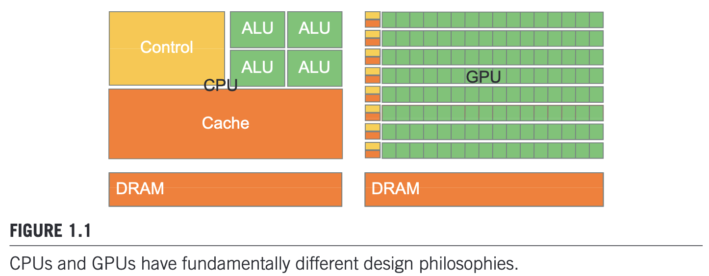
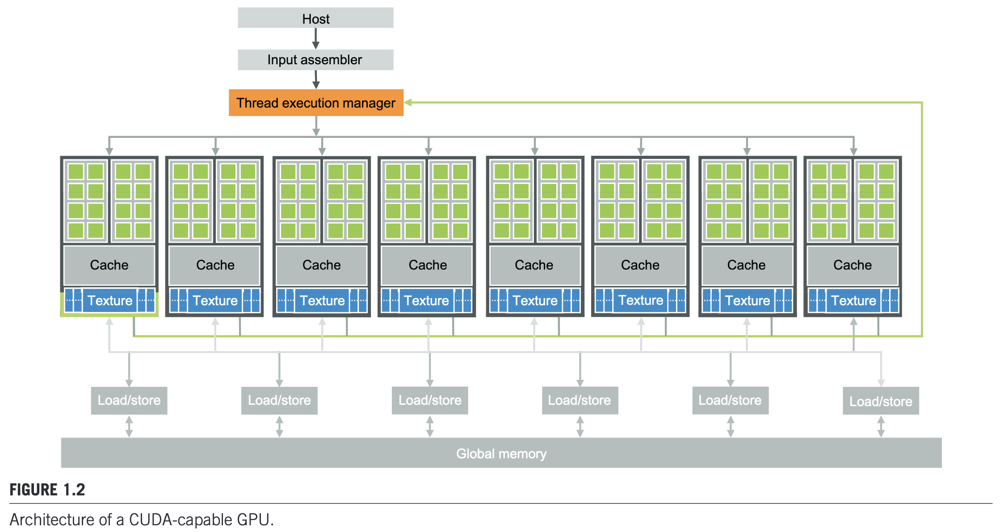

# Ch1 Introduction

## 1.1 Heterogeneous Parallel Computing

Two main trajectories of modern microprocessor design since 2003:

- multicore trajectory: maximize the execution speed of sequential programs (latency-oriented design)
    - sophisticated control logic to support out-of-order execution
    - large caches to reduce the instruction and data access latencies
    - e.g. Intel CPUs
- many-thread trajectory: maximize the execution throughput of parallel programs (throughput-oriented design)
    - large number of threads with simple control logic
    - small caches to reduce the bandwidth requirements
    - e.g. NVIDIA GPUs

Many applications use both CPUs and GPUs, executing the sequential parts on CPUs, and the parallel parts on GPUs. The demand for joint CPU-GPU execution is further reflected in recent programming models such as OpenCL, OpenACC, C++AMP, and CUDA, introduced by NVIDIA in 2007.

## 1.2 Architecture of a Modern GPU

The architecture of a CUDA-capable GPU (Pascal) is shown below:

- processors
    - streaming multiprocessors (SMs): the basic compute unit of a GPU, containing multiple streaming processors (SPs) that share control logic and instruction cache
    - streaming processors (SPs): the basic execution unit of a GPU
- memories
    - Grapics Double Data Rate (GDDR) Synchronous Dynamic Random Access Memory (SDRAM): the global memory of a GPU, used to store data and instructions
    - High Bandwidth Memory (HBM): a type of memory used in some GPUs, providing higher bandwidth than GDDR
- interconnects
    - PCI Express Generation 2 (PCIe Gen2)
        - trasfer data from system memory to global memory at 4 GB/s
        - transfer data from global memory to system memory at 4 GB/s
        - total bandwidth of 8 GB/s
    - NVIDIA NVLink
        - CPU-GPU and GPU-GPU interconnect that allows transfers of 40 GB/s per channel

## 1.5 Challenges in Parallel Programming

1. Parallem algorithm design
2. Memory-bound applications
3. Erratic input data characteristics
4. Nonintuitive ways to think about recurrence problems

## 1.7 Overarching Goals

1. To learn how to program massively parallel processors to achieve high-performance without a great deal of of hardware expertise
2. To learn parallel programming for correct functionality and reliability
3. To learn how parallel programs scale up to the performance of future generation of machines
