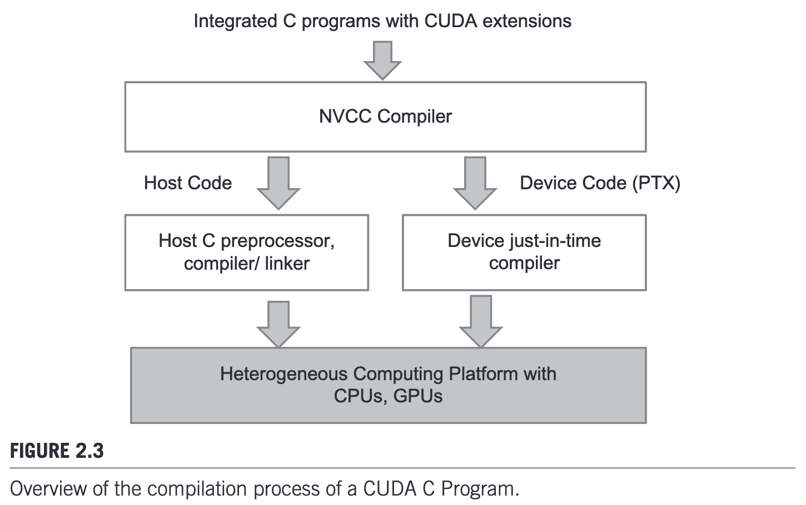
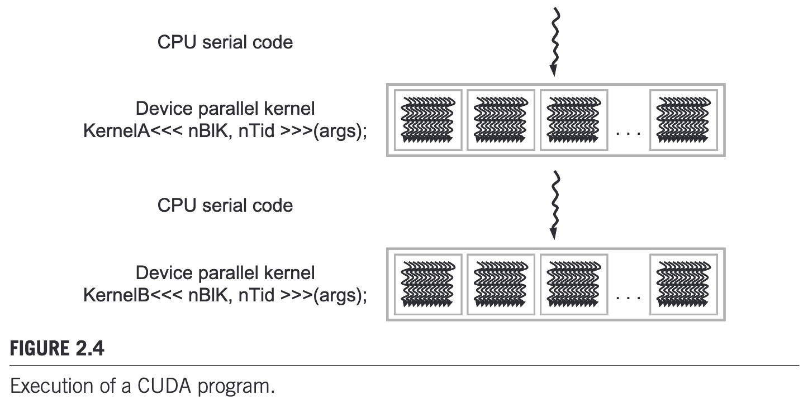

# Ch2 Data Parallel Computing

## 2.1 Data Parallelism

Data parallelism: organize the computation around the data, such that we can execute the resulting independent computations in parallel to complete the overal job faster.

## 2.2 CUDA C Program Structure

- Each CUDA source file can have a mixture of both host and device code.
- The functions or data declarations for device are clearly marked with special CUDA C keywords.

